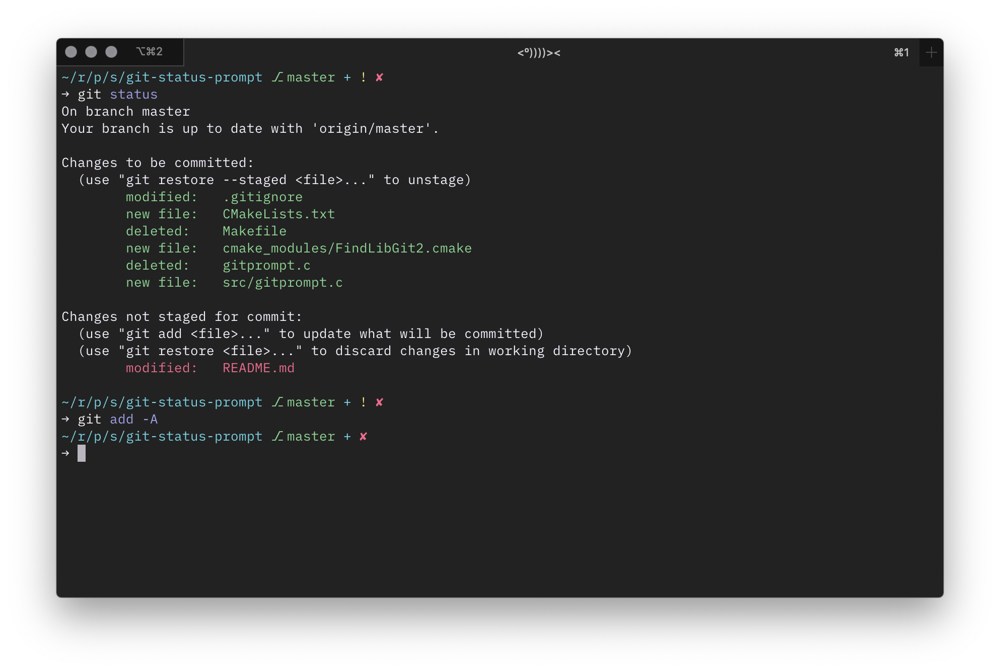

## Gondolin Prompt

A blatant rip-off of [Git Super Status II Turbo: Hyper Fighting](https://github.com/deathlyfrantic/git-status-prompt).



This version aims to replicate the design of [Gondolin](https://github.com/tylerreckart/gondolin) minus the SHA and time since last commit info.

### Configuration

Have a look at the configuration section in `gitprompt.c` and define the macros to be whatever you like. Note the color definitions are fish-specific but can be modified to work in zsh.

### How to Use

1. Install libgit2. You can use [vcpkg](https://github.com/microsoft/vcpkg) to grab and build a copy.
2. Install [cmake](https://cmake.org).
3. Clone this repository.
4. Inside the cloned repo do
   ```
   mkdir build
   cd build
   cmake ..
   make
   cp git_status_prompt /usr/local/bin
   ```
5. Add the following snippet to your `config.fish`
   ```
   function fish_prompt
     git_status_prompt $status
   end
   ```


### License

MIT
